<div align="center">


# Forge

**A development-first browser for macOS.** Chromium under the hood, native AppKit on top,
built around the things a developer actually does all day instead of a panel you open and close again.

[](https://github.com/hxr4/forge_brow/releases/latest)
[](#requirements)
[](#architecture)
[](LICENSE)

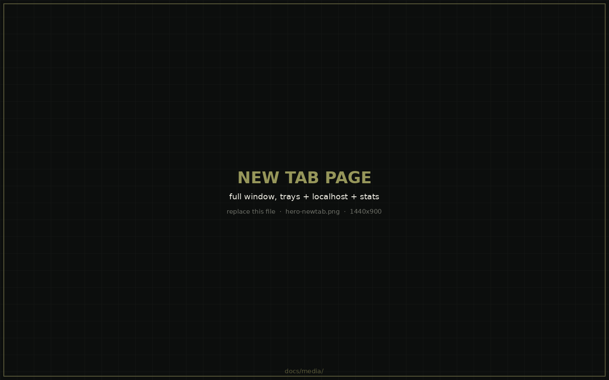

</div>

---

## Contents

- [What this is](#what-this-is)
- [Why it exists](#why-it-exists)
- [Highlights](#highlights)
- [Install](#install)
- [Build from source](#build-from-source)
- [Keyboard shortcuts](#keyboard-shortcuts)
- [Content blocking, honestly](#content-blocking-honestly)
- [Architecture](#architecture)
- [Build notes for anyone using CEF](#build-notes-for-anyone-using-cef)
- [Safety model](#safety-model)
- [Known limits](#known-limits)
- [Roadmap](#roadmap)
- [How this was built](#how-this-was-built)
- [Change history](#change-history)

---

## What this is

A personal browser, in daily use, released publicly because there's no reason not to.

It is not trying to replace Chrome or Brave, and it will not win a feature comparison
against either. There is no password manager, no extension store, no sync, no PDF viewer.
What it has instead is a set of things no mainstream browser does, because no mainstream
browser has a userbase that wants them.

**Current release: 1.2.0.** Verified on macOS 26, Apple Silicon.

## Why it exists

Every mainstream browser treats development as a drawer. Forge makes it the furniture.

| | |
|---|---|
| **Your dev servers are part of the browser** | Running localhost services appear on the new tab page with port, process and a one-click open. No other browser knows or cares that you have a server up. |
| **A tab pointed at a dev server reloads itself when the server restarts** | Save, rebuild, and the tab is already showing the new build. |
| **Thirteen local utilities** | JSON, JSON→TypeScript, SQL, JWT, Base64, URL, hash, UUID, timestamp, regex, colour, gradient, box-shadow. No network, no extension permissions. You stop pasting production tokens into strangers' websites. |
| **You can see every host a page talks to** | And block any of them permanently with one click. |
| **The media stats are real measurements** | Codec off the MediaSource buffer, bitrate from appended bytes, your actual output device and whether macOS is resampling. |
| **Security bypasses can't be silently left on** | Ignoring certificate errors is scoped to one tab and paints it orange until you turn it off. |

---

## Highlights

### Command palette over everything

⌘K reaches tabs, tools, ports, history and settings from one input.

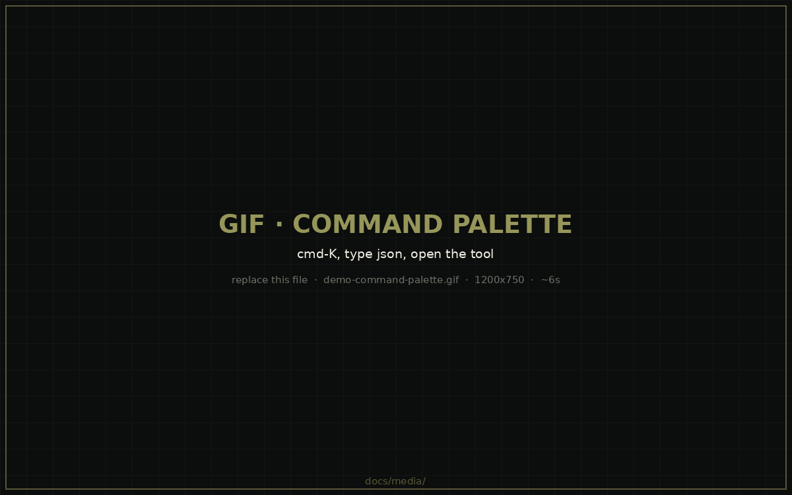

### Request inspector

The sidebar's Network section lists every host the active tab has talked to, with request
and blocked counts, live. Filter it, and block any host permanently with one click — the
rule persists across launches and is applied ahead of the filter engine on every request.
A host you've blocked keeps a lit marker whether or not you're hovering the row.

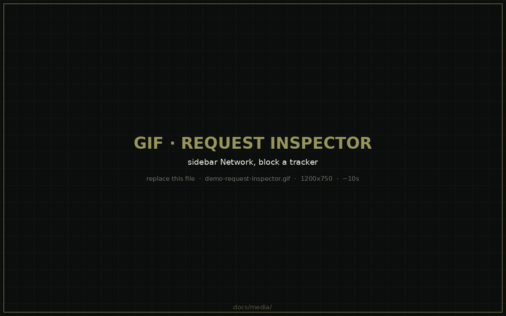

### Audio path, for people who care

When something is playing, stats for nerds shows the whole signal chain: codec and
container read from the MediaSource buffer, bitrate measured from appended bytes, channel
count, the browser's mix rate, then your real output device with its sample rate, physical
bit depth and transport — and whether macOS is resampling between the two. With a live
spectrum. Works on any site that streams over MSE.

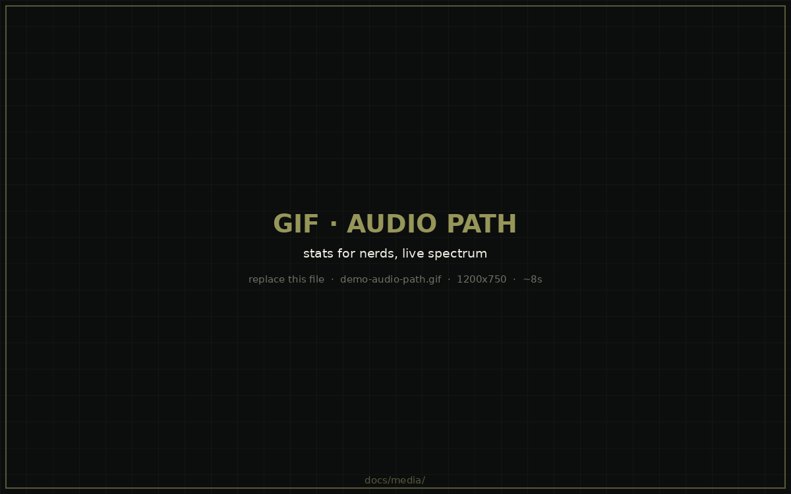

### Video pipeline

Codec, resolution, framerate, measured bitrate, bit depth, dropped frames, and the decoder
name and hardware-or-software decode path, read from the DevTools Media domain.

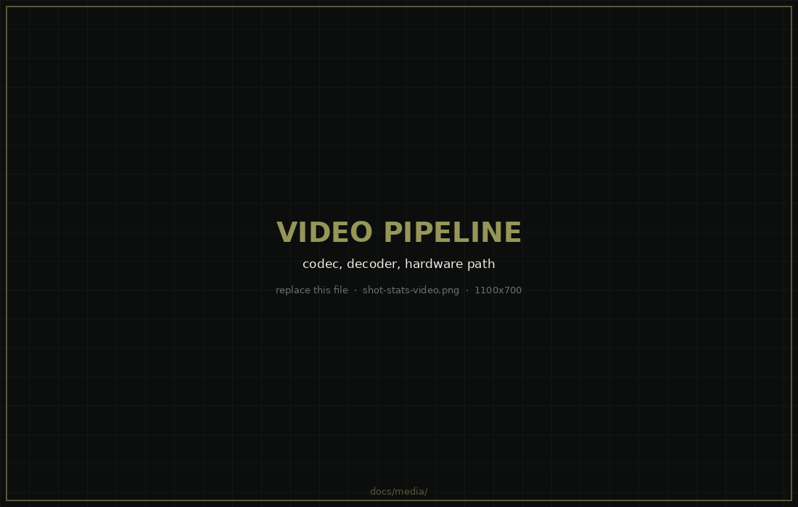

### Dev server auto-reload

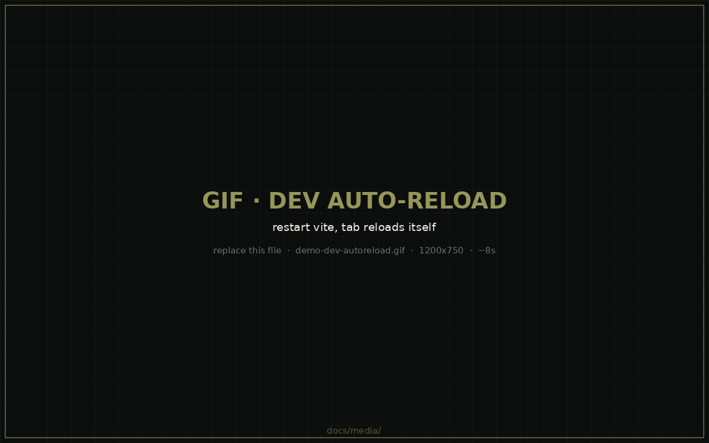

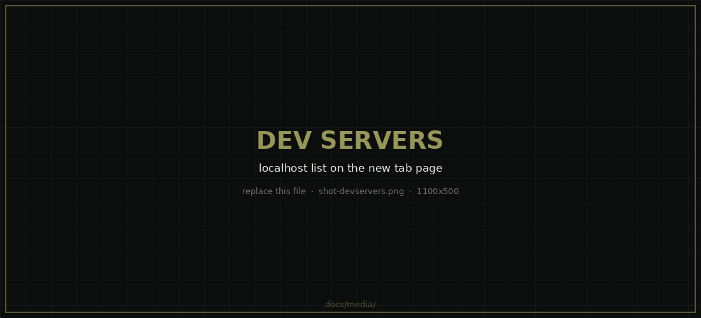

### Tabs that survive being used

Horizontal or vertical. Favicons cached per host on disk. Named, coloured, collapsible
groups that keep their members contiguous. The strip scrolls once tabs overflow, with the
new-tab button pinned outside the scrolling area and an overflow menu listing everything.

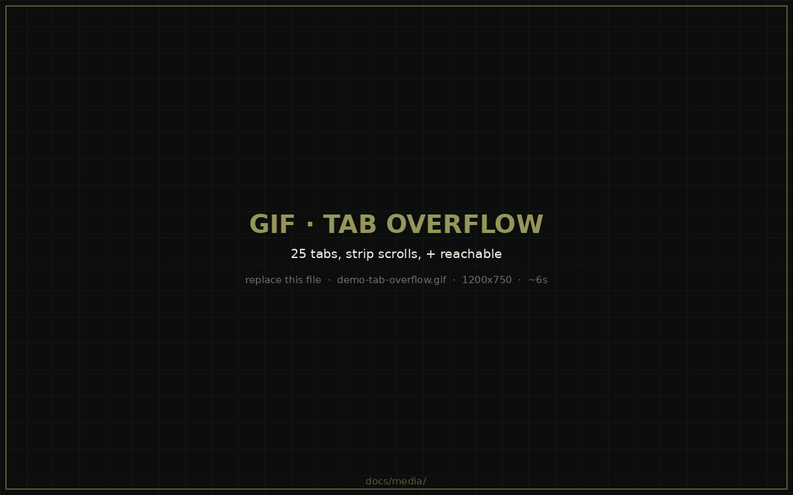


### Sidebar

A persistent icon rail plus a slide-out panel: live tab manager with groups and filtering,
network inspector, tools, bookmarks, history, downloads.

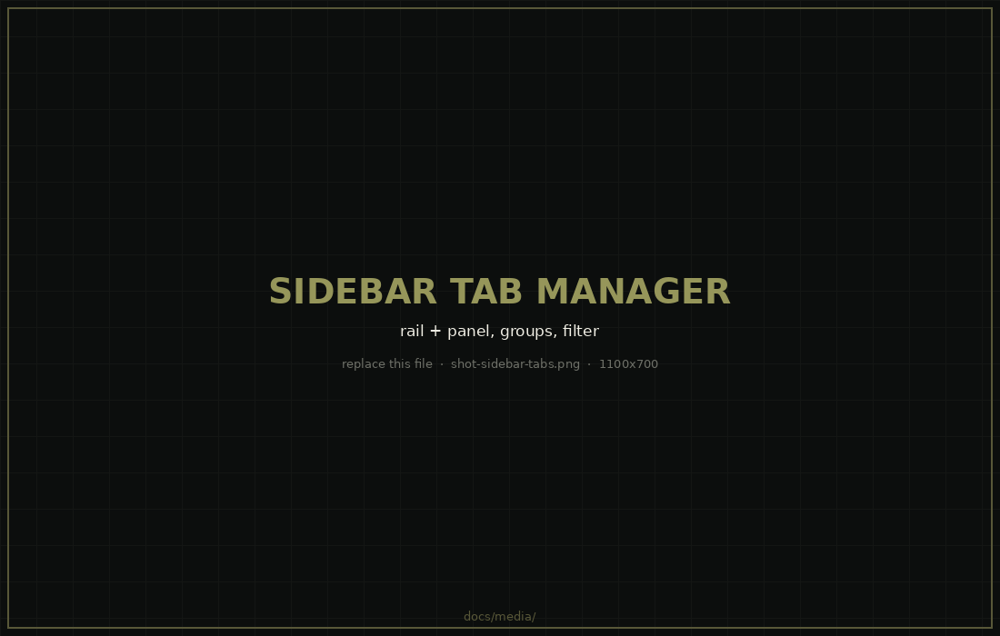

### Private windows

A separate in-memory request context, its own landing page, no history recording, and a
persistent `PRIVATE` marker in the toolbar.

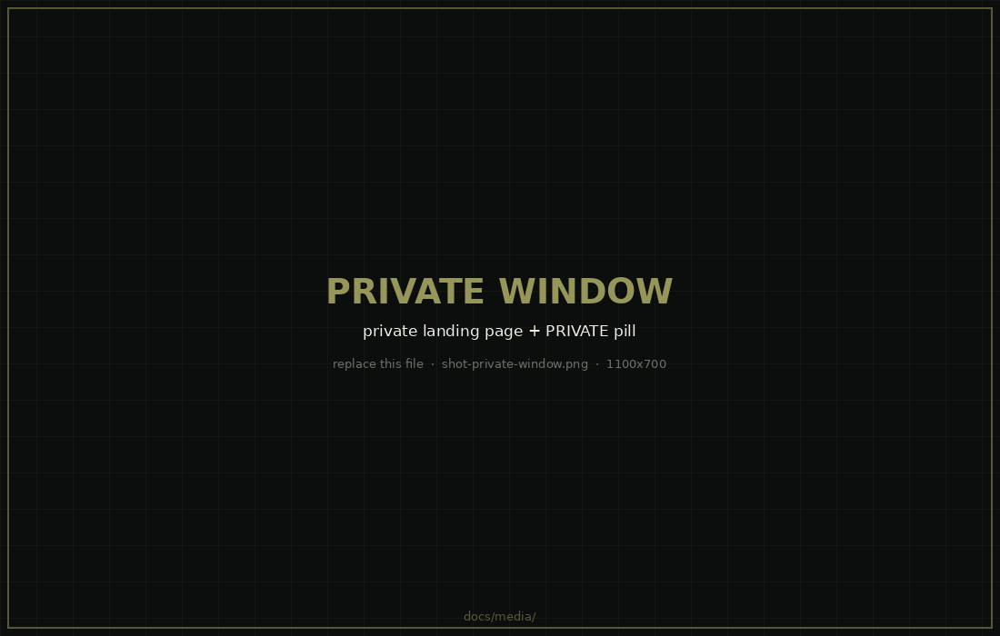

### Utility belt

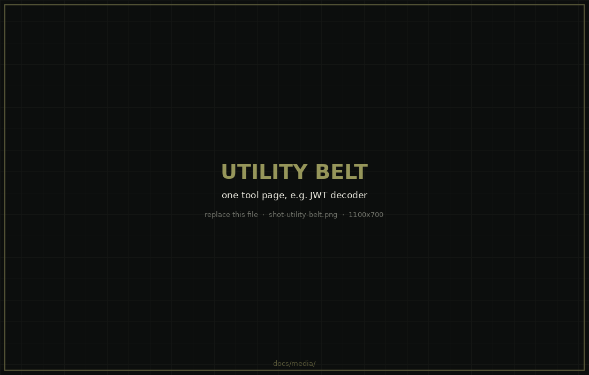

### Bypass indicators you can't miss

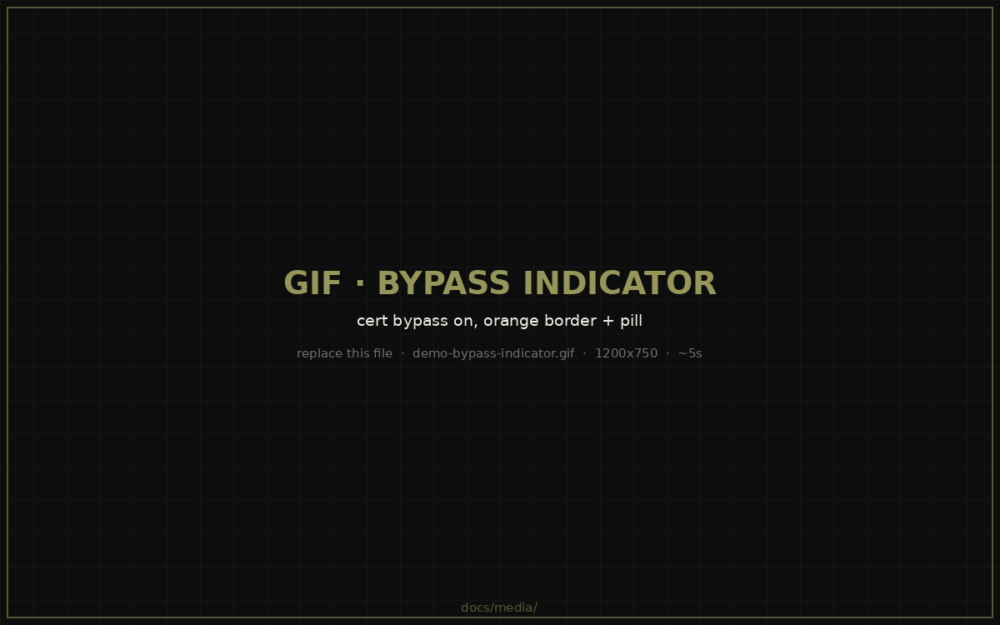

---

## Install

### From a release

The build is signed with a locally generated certificate and is **not notarized**, so
macOS will refuse to open it until you say otherwise. That is expected, and you should
understand what step 4 is before you do it.

1. Download `Forge-Browser-1.2.0-arm64.zip` from [the latest release](https://github.com/hxr4/forge_brow/releases/latest).
2. Double-click to unzip.
3. Move `Forge Browser.app` to `/Applications`.
4. Clear the download quarantine flag:

   ```sh
   xattr -dr com.apple.quarantine "/Applications/Forge Browser.app"
   ```

   No Terminal? Double-click the app, let it get blocked, then go to **System Settings →
   Privacy & Security**, scroll to Security, and click **Open Anyway**. On macOS 15 and
   later the old right-click → Open trick no longer works.
5. Launch it. macOS asks for keychain access once — that's Chromium creating its
   safe-storage item. Click **Always Allow**.

**Apple Silicon only.** The build is `arm64`; it will not launch on an Intel Mac.

Step 4 is you overriding Gatekeeper. That's reasonable for software you can build from
source and audit. It is not general advice for downloaded binaries.

### Requirements

- Apple Silicon Mac, macOS 13 or later
- For building: Xcode command line tools, Homebrew

---

## Build from source

```sh
git clone https://github.com/hxr4/forge_brow.git
cd forge_brow
./scripts/bootstrap.sh     # cmake, ninja, xcodegen, rust, CEF, filter lists
./scripts/build.sh         # generates the Xcode project, builds, assembles the bundle
./scripts/run.sh           # launches it
```

`bootstrap.sh` downloads the CEF binary distribution (~265 MB) into `third_party/`, which
is gitignored. The first build compiles `libcef_dll_wrapper` from source and takes a few
minutes.

**Build through `scripts/build.sh`, not Xcode's Run button.** Bundle assembly — framework,
five helper processes, signing — happens after `xcodebuild`, for the reason in
[build notes](#build-notes-for-anyone-using-cef).

Optional: `./scripts/setup-signing.sh` creates a stable self-signed code-signing identity
so macOS stops re-prompting for keychain access on every rebuild.

Run an isolated session at any time:

```sh
FORGE_PROFILE=scratch ./scripts/run.sh
```

---

## Keyboard shortcuts

| | |
|---|---|
| ⌘K | Command palette |
| ⌘T / ⌘W | New tab / close tab |
| ⌘N / ⇧⌘N | New window / new private window |
| ⌘L | Focus the address bar |
| ⌘R / ⇧⌘R | Reload / force reload |
| ⌘0 / ⌘+ / ⌘− | Actual size / zoom in / zoom out |
| ⌃⌘S | Toggle sidebar |
| ⇧⌘E | Toggle vertical tabs |
| ⌥⌘S | Stats for nerds |
| ⌥⌘I | DevTools |
| ⌥⌘U | View source |
| ⌘F / ⌘G / ⇧⌘G | Find / next / previous |
| ⇧⌘J | Downloads |
| ⌃⌘F | Full screen |
| ⌘P | Print |

---

## Content blocking, honestly

A blocked-request counter on its own is misleading, so here is the actual state.

| Layer | State |
|---|---|
| Network filtering (requests cancelled) | **Working.** 205k+ rules from 8 lists. |
| Popup blocking | **Working.** Non-gesture popups blocked; `target=_blank` becomes a tab. |
| Cosmetic filtering, domain-specific | **Working.** Element-hiding CSS injected per page. |
| Custom per-host rules | **Working.** Persisted, applied ahead of the engine. |
| YouTube video ads | **Working.** First-party module, see below. |
| Generic scriptlet rules (`##+js(...)`) | **Not implemented.** See below. |
| Generic cosmetic rules (class/id) | **Not implemented.** Needs renderer-side class/id collection. |

Lists: EasyList, EasyPrivacy, uBlock Origin (filters, privacy, quick-fixes, badware,
annoyances-cookies), Fanboy annoyances.

"Bandwidth saved" and "time saved" on the landing page are **estimates** from
per-resource-type averages, and are labelled as such in the UI. Blocked-request and popup
counts are exact, counted by real resource type.

### Why YouTube needed its own module

In-stream ads can't be blocked at the network layer: they come from the same
googlevideo.com hosts as the video, described in the same player response. uBlock Origin
strips them with scriptlets that prune the ad slots before the player reads them.

Forge can't run those scriptlets. adblock-rust's resource assembler parses only uBlock's
*old* scriptlet format — its own documentation says the current format is an ES module and
recommends converting it in JS — and the resource file Brave publishes at the obvious URL
holds 17 Brave-specific scripts, not the scriptlet library. That is why earlier builds
reported zero bytes of scriptlet on every page.

So Forge ships its own module, injected at document start over the DevTools protocol. It
arms only on YouTube, wraps `JSON.parse` and `Response.prototype.json`, and defines a
setter for `ytInitialPlayerResponse`, deleting `adPlacements`, `playerAds`, `adSlots` and
siblings before the player sees them. A sweep skips and dismisses anything that starts
anyway. Every deletion is counted and shown in stats for nerds.

Verified on a signed-out profile — no Premium — on heavily monetised videos: content starts
immediately with no pre-roll.

This is one site handled deliberately, not a scriptlet engine.

---

## Architecture

```
App/Sources         Swift  — window, tabs, palette, menus, history, bookmarks, sidebar
native/ForgeCEF     ObjC++ — shim over the CEF C++ API, exposes plain ObjC to Swift
native/shared       C++    — scheme registration shared by app and helper
helper/             ObjC++ — CEF helper process entry point (sandboxed)
rust/forge-adblock  Rust   — C ABI over adblock-rust, static library
App/Resources/web   HTML   — landing page, settings, history, tools, served over forge://
```

Swift never sees a C++ type. Everything crossing the boundary is plain Objective-C, which
is what the bridging header imports.

### Pages talk over a scheme, not a JS bridge

Internal pages are served over a custom `forge://` scheme.
`GET forge://home/api/state` returns app state, `POST forge://home/api/command` dispatches
an action. No renderer-side code needed.

Internal pages: `forge://settings`, `forge://history`, `forge://bookmarks`,
`forge://downloads`, `forge://tools`, `forge://help`.

`GET /api/state` includes a `revision` integer that only changes when the content behind it
changes. Poll it and skip re-rendering when it hasn't moved — the state is otherwise
identical between polls, and re-rendering it is what made static content look like it was
reloading.

`POST /api/command` actions for the landing page shortcuts:

| action | payload | effect |
| --- | --- | --- |
| `addShortcut` | `title`, `url`, `tray` (optional) | add a tile; first tray if `tray` is omitted |
| `removeShortcut` | `url`, `tray` (optional) | remove from one tray, or all when omitted |
| `moveShortcut` | `tray`, `url`, `index` | reorder within a tray |
| `renameShortcut` | `tray`, `url`, `title` | rename a tile |
| `addTray` / `removeTray` | `name` | add or remove a tray; the last tray cannot be removed |
| `renameTray` | `from`, `to` | rename a tray |

Adding is a no-op for a URL already in the tray. Every one of these bumps `revision`.

### Asking a page a question

`FGBrowserView -evaluate:completion:` runs JavaScript in a tab and returns the value, built
on `ExecuteDevToolsMethod("Runtime.evaluate")` plus a `CefDevToolsMessageObserver`. It needs
no DevTools front-end and no renderer-side code.

This is the load-bearing trick in the whole project. The now playing bar, the stats
overlay, the audio and video panels and the YouTube module are all built on it. If you're
building something on CEF and think you need a renderer-side extension, you probably don't.

---

## Build notes for anyone using CEF

Four things about CEF on modern macOS that cost real time.

**`cef_sandbox.a` no longer exists.** As of CEF 144 the sandbox is exported as a C API from
the framework itself, and `CefScopedSandboxContext` lives in `libcef_dll_wrapper`. The
helper links only `-lcef_dll_wrapper` — no `-lcef_sandbox`, no `-lsandbox`. The sandbox is
on (`settings.no_sandbox = false`).

**Xcode's `Validate` step rejects the CEF framework.** CEF ships a flat, unversioned
framework whose `Info.plist` sits at `Resources/Info.plist`, which `builtin-validationUtility`
doesn't recognise, and `VALIDATE_PRODUCT=NO` does not disable the step. Bundle assembly
therefore runs *after* `xcodebuild`, from `scripts/build.sh`, so Xcode never sees the
framework.

**`CefWindowInfo` on macOS has only `SetAsChild` and `SetAsWindowless`.** There is no
`SetAsPopup`. For DevTools, pass a default-constructed `CefWindowInfo`.

**`DoClose` must return `true` for tab browsers.** Returning `false` makes CEF send a close
notification to the *top-level window*, so closing one tab closes the whole window — and
with `applicationShouldTerminateAfterLastWindowClosed`, quits the app.

---

## Safety model

Any tab with a bypass active shows a persistent indicator — orange tab border plus a
`⚠︎ CERT CHECKS OFF` pill in the toolbar — for as long as it is active. Bypasses are always
scoped to one tab, never global. There is no global switch, by design.

Group colours never use amber, and a tab with an active bypass suppresses its group accent,
so amber in the tab strip only ever means a bypass is on.

Forge declares usage descriptions for every capability it hands to web content — Bluetooth,
camera, microphone, location, speech, local network, user folders. macOS aborts any process
that touches one of these without a declared purpose, which is what used to kill the browser
the moment a sign-in page offered a passkey.

Renderer processes run inside the Chromium sandbox.

No keys are committed. Copy `config/forge.env.example` to `config/forge.env`, which is
gitignored.

---

## Known limits

Things that are absent or weak, stated plainly so you can decide whether this is useful to
you.

- **No session restore.** Quit or crash with tabs open and they're gone. Top of the roadmap.
- **No tests.** Roughly 10k lines and no test suite. Every regression so far was found by
  looking at the screen.
- **No password manager or autofill.** Chromium's password stack isn't in CEF. Sign-ins work;
  nothing is saved.
- **No extensions.** CEF can't practically provide them.
- **No PDF viewer, no spellcheck.**
- **Generic scriptlet and cosmetic filter rules don't run.** See above.
- **Widevine DRM and HDR are best-effort.** Development was prioritised over streaming.
- **History is a linear array.** Fine at current sizes, will not stay fine.
- **Not notarized.** See [Install](#install).
- **Third search engine slot is unimplemented.** DuckDuckGo and Brave Search are wired up.
- **The landing page weather widget needs an AccuWeather key.**

---

## Roadmap

Phase 2, in the order it'll be done:

1. **Session restore and crash recovery** — the difference between a project and a daily driver.
2. **A test harness** around the non-UI logic: storage, custom rules, dev server monitor, the adblock FFI boundary.
3. **`forge://diagnostics`** — live process count, per-helper memory, handler leaks, timer load. Making failures legible.
4. **Break up `BrowserWindowController`** — 1,500 lines is hostile to whoever edits it next.
5. **Replace the history data structure** — indexed lookup and frecency ranking instead of a linear scan per keystroke.

Deliberately not planned: extensions, sync, password management, parity with Chrome. The
answer to "why doesn't Forge do X" is often "because Brave is still installed."

---

## How this was built

One person, no team, with Claude Opus 5 as the implementing agent. The commit history
carries `Co-Authored-By` throughout.

Worth being precise about the division of labour, because it's the most interesting thing
about the repo. The Swift and C++ were written by the model — the author hasn't written a
line of either in this project. The product decisions, the diagnosis, and every instance of
catching the model being confidently wrong came from the author. That second part turned out
to be load-bearing: at one point the blocked-request panel was showing ad/tracker/analytics
splits derived from invented ratios, presented as measurements. They looked entirely
plausible. Real per-type counters replaced them. The YouTube blocking was "verified" once
against a signed-in Premium profile, which proved nothing, and had to be redone signed-out.

The lesson isn't that agentic coding doesn't work — a 10k-line multi-process browser exists
and is in daily use. It's that the output needs someone who knows what the answer should
look like.

---

## Change history

### 1.2.0

**Tabs**
- Site favicons on tabs, cached per host on disk.
- Named, coloured, collapsible tab groups that keep their members contiguous.
- The tab strip scrolls once tabs overflow, with the new-tab button pinned outside the
  scrolling area and an overflow menu listing every tab. Past roughly twenty tabs the
  button used to be overlapped and unreachable.
- Right-click a tab for duplicate, duplicate in a private window, mute, group, close,
  close others, and close to the left or right.
- The strip no longer re-animates on every title change.

**Windows**
- Private windows on a separate in-memory request context, with their own landing page,
  no history recording, and a persistent PRIVATE marker in the toolbar.
- Sidebar: a persistent icon rail plus a slide-out panel — tab manager, network, tools,
  bookmarks, history, downloads.
- `FORGE_PROFILE=name` runs an independent session.
- Clicking the dock icon with no windows open reopens one.

**Blocking**
- YouTube video ads are defused at document start by a first-party module.
- Blocked requests are counted by real resource type instead of invented categories.
- Request inspector: every host the active tab has talked to, with request and blocked
  counts, filterable, and a per-host block toggle that persists across launches and applies
  ahead of the filter engine. A blocked host keeps a lit marker whether or not the row is
  hovered.

**Stats for nerds**
- Scrolls, so it holds everything rather than being clipped.
- Audio path: codec and container from the MediaSource buffer, bitrate measured from
  appended bytes, channel count, browser mix rate, the output device with its sample rate,
  physical bit depth and transport, and whether the system is resampling. With a live
  spectrum.
- Video pipeline: codec, resolution, framerate, measured bitrate, bit depth, dropped
  frames, and the decoder name and hardware or software decode path.

**Elsewhere**
- Omnibox suggestions: history and bookmarks merged with live completions from the active
  engine, debounced and switchable off.
- Now playing bar with artwork, progress, transport controls and click-to-jump.
- New tab page rebuilt; shortcut trays editable in place.
- Dev servers filtered to plausible ones, with a toggle to show every listening port, and
  tabs pointed at a server reload themselves when it restarts.
- Forge registers as an http/https handler and opens URLs passed from other applications.

### 1.1.0

- Declared privacy usage descriptions. Without them macOS aborted the process the moment a
  sign-in page offered a passkey, because that reaches for CoreBluetooth.
- Stopped rebuilding the entire page state on a 1.5 second timer, which was allocating
  roughly two hundred ICU date formatters per second on the main thread.

### 1.0.0

- First working build: CEF rendering, native AppKit shell, adblock-rust network filtering,
  command palette, dev server dashboard, per-tab bypass toggles with persistent indicators,
  and the developer utility belt.

---

## License

MIT
